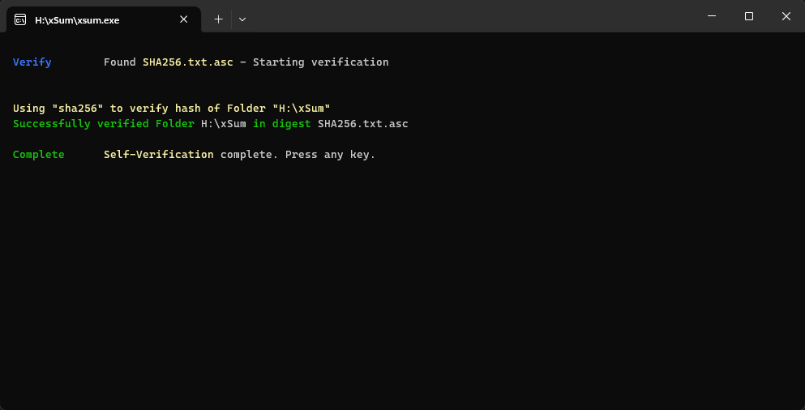
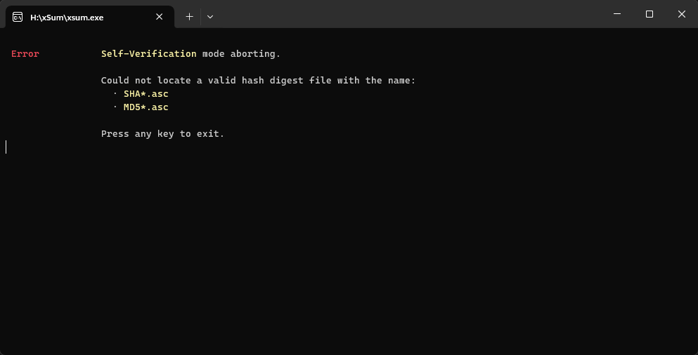

<p align="center"></p>
<h1 align="center"><b>xSum Hash Utility</b></h1>

<div align="center">

   

</div>

<br />

---

<br />


- [About](#about)
  - [Supported Algorithms](#supported-algorithms)
  - [What Is A Hash Digest](#what-is-a-hash-digest)
- [Arguments](#arguments)
  - [Main Arguments](#main-arguments)
  - [Sub Arguments](#sub-arguments)
  - [Other Arguments](#other-arguments)
- [Syntax](#syntax)
    - [`--generate`](#--generate)
    - [`--verify`](#--verify)
    - [`--sign`](#--sign)
    - [`--target`](#--target)
    - [`--digest`](#--digest)
    - [`--algorithm`](#--algorithm)
    - [`--output`](#--output)
    - [`--overwrite`](#--overwrite)
    - [`--progress`](#--progress)
    - [`--lowercase`](#--lowercase)
    - [`--clipboard`](#--clipboard)
    - [`--exclude`](#--exclude)
    - [`--key`](#--key)
    - [`--clearsign`](#--clearsign)
    - [`--detachsign`](#--detachsign)
- [Features](#features)
  - [Help Menu](#help-menu)
  - [Target Types](#target-types)
  - [Automatic Checking](#automatic-checking)
  - [Benchmark](#benchmark)
    - [Standard Benchmark](#standard-benchmark)
    - [Algorithm Stress Test Benchmark](#algorithm-stress-test-benchmark)

<br />

---

<br />

> [!NOTE]
> This utility is currently in development. Not all features are complete. If you see some aspect of the code that could be improved, you're more than welcome to commit. All code will be reviewed before it is accepted.

<br />

---

<br />

# About

This utility allows you to generate, sign, and validate checksums.

While there are numerous apps available for doing things such as this; I need a tool that was very specific, and allowed for this to all be done very easily without complicated excessive options.

<br />

## Supported Algorithms
Currently, the following algorithms are suppported. More are planned for later.

- MD5
- SHA1
- SHA2-256
- SHA2-384
- SHA2-512
- SHA3-224
- SHA3-256
- SHA3-384
- SHA3-512
- Blake2b-128
- Blake2b-160
- Blake2b-256
- Blake2b-384
- Blake2b-512
- Blake2s-128
- Blake2s-160
- Blake2s-256
- Blake2s-384
- Blake2s-512

<br />

For a list of supported algorithms, type

```shell
xsum
```

<br />

Supports specifying algorithms with and without hyphens:

```shell
xsum --generate "MyFolder" --algo sha3-256
xsum --generate "MyFolder" --algo sha3256
```

<br />

## What Is A Hash Digest
When using `--generate`, a hash digest will be created which contains a list of all the files you have targeted.  When that digest is generated, it will be created as a file named depending on what hash algorithm you specified.

You may either specify your own name for the hash digest, or let the utility pick a name.

If you generated a hash digest using `SHA512` and did not specify  `--digest <FILE>`, your hash digest will be generated as `SHA512.txt`.

When you open the hash digest in a text editor, you will see something similar to the following:

```
d63ba16a664619c2dc4eb2aeef2a2e64cbc7931b831e0adf1c2275ee08e8fd47  example_file_1.txt
dfb8dacbd53eac730814ef2e9f74a47efabe5cb2a5e458bcad6380ae4c1f1f59  example_file_2.txt
9f86d081884c7d659a2feaa0c55ad015a3bf4f1b2b0b822cd15d6c15b0f00a08  sample_zip_1.zip
60303ae22b998861bce3b28f33eec1be758a213c86c93c076dbe9f558c11c752  README.md
```

<br />

---

<br />

# Arguments
The following is a description of all the arguments associated with this utility.

<br />

## Main Arguments
The following arguments are considered the **primary** arguments of this utility.

<br />

| Argument | Description |
| --- | --- |
|  | Generate a new hash digest from the `--target <FILE>` |
|  | Verify existing digest and compare folder with `--target <FILE>` |
|  | Signs an existing hash digest using GPG |

<br />

## Sub Arguments
Along with the main features listed above, the following sub-arguments can be used to configure out xsum works for you:

<br />

| Argument | Description |
| --- | --- |
|  | Target folder or file to generate / verify hash for |
|  | Hash digest which contains list of generated hashes |
|  | Algorithm used to generate or verify hash |
|  | Output log file for tasks |
|  | Overwrite results to `--output` instead of append |
|  | Displays progress info for each task step |
|  | Match and output hash value(s) in lower case instead of upper case |
|  | Copies the output hash value to clipboard. |
|  | Exclude files not hashed with `-g` and `-v` |
|  | GPG key to use signing digests with --sign |
|  | Sign the hash digest using GPG with a clear signature |
|  | Sign the hash digest using GPG with a detached signature |
|  | Perform benchmarks on a specific algorithm or all. |
|  | Number of iterations to perform for `--benchmark` |
|  | Buffer size to use for `--benchmark` |
|  | Debugging information |

<br />

## Other Arguments
The following are a list of extra functionality:

<br />

| Argument | Description |
| --- | --- |
|  | Print list of out-of-box excluded files |
|  | Prints all of the GPG keys in your keyring |

<br />

---

<br />

# Syntax
This utility attempts to be semi "smart" in the aspect that you can execute commands in various different ways. The reason for this is because out of the other hashing tools out there, we try to use a similar syntax for this utilities' commands so that there's very little in means of transitioning, and to make it more comfortable.

<br />

### `--generate`
Compute hash for folder, files, or strings and generate new hash digest

<br />

<details>
<summary><sub>Read More</sub></summary>

<br />

The `--generate` argument allows you to create a new hash digest from the target folder. This argument requires you to specify a target file or folder using one of the following ways:

<br />

| Expects | Description |
| --- | --- |
| `--generate Path\To\Folder` | Folder to generate hash digest for |
| `--generate --target Path\To\Folder` | Same as above
| `--generate Path\To\File.xxx` | File to generate hash digest for |
| `--generate --target Path\To\File.xxx` | Same as above

<br />

The following commands all do the same action:

```C#
xsum --generate --target "X:\Path\To\ExampleFile.zip" --algo sha256 --digest SHA256.sig
xsum --generate "X:\Path\To\ExampleFile.zip" --algo sha256 --digest SHA256.sig
```

```C#
xsum --verify --target "X:\Path\To\ExampleFile.zip" --algo sha256 --digest SHA256.sig
xsum --verify "X:\Path\To\ExampleFile.zip" --algo sha256 --digest SHA256.sig
```

</details>

<br />

---

<br />

### `--verify`
The `--verify` argument allows you to verify an existing hash digest with the source files as they are on your system.

<br />

<details>
<summary><sub>Read More</sub></summary>

<br />

To verify a hash digest, you need:
- Files for the project with the hash digest
- Hash digest

<br />

A **hash digest** is usually one of the following files:
- MD5.txt
- SHA*.txt
- SHA3*.txt
- BLAKE*.txt

<br />

Inside the hash digest is a list of every file associated with the project, as well as the hash for that file, such as the following:

```shell
d63ba16a664619c2dc4eb2aeef2a2e64cbc7931b831e0adf1c2275ee08e8fd47  Project Folder 1/myfile.txt
dfb8dacbd53eac730814ef2e9f74a47efabe5cb2a5e458bcad6380ae4c1f1f59  Project Folder 2/example_file_2.txt
9f86d081884c7d659a2feaa0c55ad015a3bf4f1b2b0b822cd15d6c15b0f00a08  Project File 1.xxx
5FD924625F6AB16A19CC9807C7C506AE1813490E4BA675F843D5A10E0BAACDB8  Project File 2.xxx
```

<br />

To verify a hash digest against the actual files, execute the following:

```shell
xsum --verify --target "Project Folder Name" --digest SHA256.txt
```

<br />

If you have `xsum.exe` in the root project folder where the project files and hash digest exist, then you can execute:

```shell
xsum --verify --digest SHA256.txt
```

<br />

If you do not specify `--target`, xSum will automatically use the directory you are executing xsum.exe from.

<br />

```
📁 Project Folder 1
📁 Project Folder 2
📄 Project File 1.xxx
📄 Project File 2.xxx
📄 SHA256.txt
🗔 xsum.exe
```

<br />

The aboe file structure will allow you to verify all project folders and files.

<br />

Then a project is successfully verified, you will receive the following:

```
> xsum --verify --digest SHA256.txt

 Lowercase:     Disabled
 Clipboard:     Disabled

 Using "sha256" to verify hash of Folder "H:\xSum"
 Successfully verified Folder H:\xSum in digest SHA256.txt
```

<br />

If you are not using SHA256, then you will need to specify the hash algorithm:

```shell
xsum --verify --digest MD5.txt --algo md5
```

<br />

**Remember**: xSum verifies a hash digest using UPPER CASE characters. If your hash digest contains hashes in lower case, you must use:

```shell
xsum --verify --digest SHA256.txt --lowercase
```

<br />

</details>

<br />

---

<br />

### `--sign`
The `--sign` argument allows you to sign a hash digest using a specified GPG key.

<br />

<details>
<summary><sub>Read More</sub></summary>

<br />

This feature requires that you have [GPG](https://gnupg.org/download/) installed on your device, and added to your Windows Environment Variables. You can also install [Gpg4Win](https://www.gpg4win.org/).

<br />

To sign a hash digest with your GPG key, open command prompt and use `--generate` to generate your hash digest.

<br />

If you navigate to the folder where the project files are, you do not need to specify a `--target`. It will automatically use the current directory as the target path.

```shell
xsum --generate --algo SHA256 --lowercase
```

<br />

The command above will generate a new file named `SHA256.txt` and all hashes will be **lowercase**. After the new file is created, you can now sign it with GPG by running:

```shell
xsum --sign --key ABCD1234 --clearsign
```

<br />

The above command will sign **SHA256.txt** using the GPG key **ABCD1234** with a **Clear Signature**. A new file will then be created which is named `SHA256.txt.asc`.

If you do not specify a signature type ( `--clearsign` or `--detachsign` ), then it will default to generating a **Clear signature**.

<br />

If you wish to sign with a detached signature, execute:

```shell
xsum --sign --key ABCD1234 --detachsign
```

<br />

To specify a target location to sign, execute:

```shell
xsum --sign --target "X:\Path\To\Folder\" --key ABCD1234 --detachsign
```

<br />

</details>

<br />

---

<br />

### `--target`
Target folder or file to generate / verify hash for

<br />

<details>
<summary><sub>Read More</sub></summary>

<br />

The **Target** is the file or folder you wish to either generate a hash for, or verify an existing hash.

This can be defined either by specifying the file or folder directly after using `--target`, or directly after the main command.

<br />

| Expects | Description |
| --- | --- |
| `--target Path\To\FILE.xxx` | File to create / verify a digest for |
| `--target Path\To\FOLDER` | Folder to create / verify a digest for. All files in folder will be added to digest. |
| `--target STRING` | Creates an SHA hash for a string and prints to console. |

<br />

The following commands all do the same action:

```C#
xsum --verify --target "X:\Path\To\ExampleFile.zip" --algo sha256 --digest SHA256.sig
xsum --generate --target "X:\Path\To\ExampleFile.zip" --algo sha256 --digest SHA256.sig
```

```C#
xsum --verify "X:\Path\To\ExampleFile.zip" --algo sha256 --digest SHA256.sig
xsum --generate "X:\Path\To\ExampleFile.zip" --algo sha256 --digest SHA256.sig
```

</details>

<br />

---

<br />

### `--digest`
Hash digest which contains list of generated hashes

<br />

<details>
<summary><sub>Read More</sub></summary>

<br />

The `--digest <FILE>` argument tells xsum either where your current digest is if you're using `-verify`, or where you want a new digest to be created if you are using `--generate`.

<br />

| Expects | Description |
| --- | --- |
| `--digest Path\To\FILE.xxx` | The file to use as the hash digest for verifying |

<br />

If you use `--generate` and do not define a hash digest, one will be generated and placed in the folder where the hashes were made, using the structure `[AlgorithmName].txt`

If you execute:
```C#
xsum --generate "X:\Path\To\ExampleFile.zip" --algo SHA512
```

The hash digest will be saved as `SHA512.txt`.

<br />

</details>

<br />

---

<br />

### `--algorithm`
Algorithm used to verify `--digest`

<br />

<details>
<summary><sub>Read More</sub></summary>

<br />

The `--algorithm <HASH>` argument specifies which algorithm to use for generation or verification.

<br />

Available Algorithms:

| Algorithm | Command |
| --- | --- |
| `--algorithm md5` | MD5 |
| `--algorithm sha1` | SHA-1 |
| `--algorithm sha256` | SHA-256 |
| `--algorithm sha384` | SHA-384 |
| `--algorithm sha512` | SHA-512 |

<br />

</details>

<br />

---

<br />

### `--output`
Output file which displays detailed information about each task.

<br />

<details>
<summary><sub>Read More</sub></summary>

<br />

The `--output` argument is an optional parameter which allows you to define a file where the results of your generated or verified results will be placed.

The information provided by `--output` is different than the output to the hash digest using `--digest`.

The hash digest contains a list of each target file and its corresponding hash. However, the output file will display step-by-step of what is going on when the hashes are generated.

<br />

| Expects | Description |
| --- | --- |
| `--output Path\To\Output.txt` | The file to output results to |

<br />

</details>

<br />

---

<br />

### `--overwrite`
Overwrite results to `--output` instead of append

<br />

<details>
<summary><sub>Read More</sub></summary>

<br />

When used in combination with `--output`, this argument will force the utility to overwrite any existing output files. If you do not specify `--overwrite`, then your current task's results will be appended to any existing result files that may have been generated from previous tasks.

<br />

</details>

<br />

---

<br />

### `--progress`
Displays in-depth information about the utility's progress during a task, as well as the checksum for each file being processed.

<br />

<details>
<summary><sub>Read More</sub></summary>

<br />

The `--progress` argument allows you to see a more detailed report about what xSum is doing.

Without this argument, you will see a simple message stating whether or not your hash digest was successfully verified, or that your new digest has been created.

However, when using this argument, you will see a larger collection of messages.

<br />

<p align="center"><sub>--progress enabled</sub></p>

<p align="center"></p>

<br />

<p align="center"><sub>--progress disabled</sub></p>

<p align="center"></p>

<br />

</details>

<br />

---

<br />

### `--lowercase`
Match and output hash value(s) in lower case instead of upper case.

<br />

<details>
<summary><sub>Read More</sub></summary>

<br />

During normal operation when this utility is processing files, the hash that this utility generates is in upper-case characters. If your hash matches the one in the digest but has different casing, then the verification will fail. The casing of your digest hash, and the hash that the utility generates must be the exact same.

Without the argument `--lowercase`, the following verification will **fail**:

```
d63ba16a664619c2dc4eb2aeef2a2e64cbc7931b831e0adf1c2275ee08e8fd47  filename.zip
```

```
D63BA16A664619C2DC4EB2AEEF2A2E64CBC7931B831E0ADF1C2275EE08E8FD47
```

<br />

This argument will transform all hashes to lowercase, both the hash produced by the utility, and the hashes in your digest, which will allow them to match as long as the hash characters are the same.

<br />

</details>

<br />

---

<br />

### `--clipboard`
Copies the output hash value to clipboard.

<br />

<details>
<summary><sub>Read More</sub></summary>

<br />

When the argument `--clipboard` is specified, the results of a task will be copied to your clipboard.

<br />

> [!NOTE]
> When targeting a folder to generate a hash, the hash of the folder itself will be copied to your clipboard, not the individual files.

<br />

</details>

<br />

---

<br />

### `--exclude`
The `--exclude` argument gives you the ability to filter out files that should not be included when your dash digest is created.

<br />

<details>
<summary><sub>Read More</sub></summary>

<br />

It allows for wildcard patterns so that you can match multiple files with one rule.

<br />

```
d63ba16a664619c2dc4eb2aeef2a2e64cbc7931b831e0adf1c2275ee08e8fd47  example_file_1.txt
dfb8dacbd53eac730814ef2e9f74a47efabe5cb2a5e458bcad6380ae4c1f1f59  example_file_2.txt
9f86d081884c7d659a2feaa0c55ad015a3bf4f1b2b0b822cd15d6c15b0f00a08  sample_zip_1.zip
60303ae22b998861bce3b28f33eec1be758a213c86c93c076dbe9f558c11c752  README.md
```

<br />

As an example, you could exclude the files `example_file_1.txt` and `example_file_2.txt` from being hashed by utilizing the `*` wildcard:

<br />

```shell
--exclude *.txt
```

<br />

For multiple exclusions, append additional `--exclude` to the end of your command:

```shell
--exclude *.txt --exclude *D*
```

<br />

With the above rules in place, any file ending with `.txt` will be excluded, and the rule `*D*` will exclude the file `README.md` since it has a `D` in the name.

```
9f86d081884c7d659a2feaa0c55ad015a3bf4f1b2b0b822cd15d6c15b0f00a08  sample_zip_1.zip
```

</details>

<br />

---

<br />

### `--key`
This argument defines which GPG key to use signing digests with `--sign`.

<br />

<details>
<summary><sub>Read More</sub></summary>

<br />

xSum gives the ability to sign your hash digest using a **GPG Key**. This command does require that you have GPG installed on your system and added to your Windows Environment Variables.

<br />

```
xsum --sign --target SHA256.txt --key ABCD1234
```

<br />

The above command will use GPG key `ABCD1234` to sigh the hash digest file in the current directory with a **Detached Signature**. In return, you will see a new file:

- **SHA256.txt.asc**

<br />

You can specify either `--detachsign` or `--clearsign`. If you want to sign your hash digest with a detached signature, execute:

```shell
xsum --sign --target SHA256.txt --key ABCD1234 --detachsign
```

<br />

In return, you will see a new file:

- **SHA256.txt.sig**

<br />

</details>

<br />

---

<br />

### `--clearsign`
The `--clearsign` argument creates a clearsign signature using GPG.

<br />

<details>
<summary><sub>Read More</sub></summary>

<br />

A clearsign signature wraps both the data and the signature into an ASCII-armored signature.

<br />

A digital signature certifies and timestamps a document. If the document is subsequently modified in any way, a verification of the signature will fail. A digital signature can serve the same purpose as a hand-written signature with the additional benefit of being tamper-resistant. The GnuPG source distribution, for example, is signed so that users can verify that the source code has not been modified since it was packaged.

<br />

When trying to clearsign a document using the GPG command-line, you could execute the following:

```
gpg -default-key <XXXXXXXX> --armor --clearsign <FILE>
```

<br />

xSum does this automatically without the need of using GPG. But you must have GPG installed on your system.

</details>

<br />

---

<br />

### `--detachsign`
The `--detachsign` argument creates a detached signature file using GPG.

<br />

<details>
<summary><sub>Read More</sub></summary>

<br />

This creates a separate signature file that is used to verify the original message if desired. In its simplest form, this file contains a hash of the original file data and is encrypted with the private key. Anyone with the public key can open the detached signature and then compare hashes to verify the integrity of the signed file.

<br />

When trying to create a detached signature for a document using the GPG command-line, you could execute the following:

```
gpg --default-key <XXXXXXXX> --armor --detach-sign <FILE>
```

<br />

xSum does this automatically without the need of using GPG. But you must have GPG installed on your system.

</details>

<br />

---

<br />

# Features
The following features are highlighted to explain them in better detail:

<br />

## Help Menu
We've attempted to give the user as much info as possible to make using the program easier. You can access the main help / commands menu by typing:

```shell
xsum
xsum /?
xsum ?
```

<br />

If you need help on a specific command, type the argument like you normally would, but append a question mark `?` at the end, such as:
```shell
xsum --benchmark ?
```

<br />

<p align="center"><sub>Help menu for the command `benchmark`)</sub></p>

<p align="center"></p>

<br />

---

<br />

## Target Types
This utility handles various different types of input:
- Files
- Folder
- Strings

If your specified input is not detected as a valid file or folder, the utility will switch over to **String Mode**, which means that it will take the string you have provided, and return a hash for that string.

<br />

<p align="center"><sub>Standard string hashing (sha256)</sub></p>

<p align="center"></p>

<br />

<p align="center"><sub>Standard string hashing (sha1)</sub></p>

<p align="center"></p>

<br />

---

<br />

## Automatic Checking
xSum will be typically launched using **Command Prompt** or **Powershell** and executing all xSum commands through one of those methods.

<br />

However, xSum has the ability to be launched as a regular executable. When you click on the xsum.exe executable, the utility will automatically go into **Verify Mode**. In order to utilize this mode, xsum.exe must be in the same folder as a hash digest file, which can be any of the following:

- MD5.*.asc
- SHA1.*.asc
- SHA256.*.asc
- SHA384.*.asc
- SHA512.*.asc
- BLAKE.*.asc

<br />

Once xSum finds the hash digest file, all of the files will be automatically checked.

<br />

<p align="center"></p>

<br />

If you attempt to run xsum.exe in a folder where a hash digest is not present, you will see the following screen:

<p align="center"></p>

<br />

---

<br />

## Benchmark
xSum includes a **Benchmark** feature, which allows you to test the performance of the various different hashes.

<br />

The benchmark functionality includes a few different modes:

| Mode | Description | Example Command |
| --- | --- | --- |
| **Standard Benchmark** | Run each algorithm through a series of performance tests | `xsum.exe --benchmark --buffer 32000000 --iterations 50` |
| **Algo Stress Test** | Stress the processing speeds of one particular algorithm. | `xsum --benchmark --algo md5 --iterations 100000` |

<br />

---

<br />

### Standard Benchmark
This will test each algorithm by throwing a series of hashing tasks at it. The test will perform `2 Rounds` for each algorithm in order to ensure everything is properly warmed up.

<br />
<br />

Each algorithm will be assessed using 4 methods:

| Name | Method | Notes |
| --- | --- | --- |
| Unmanaged | `SHA*Cng` | |
| Managed | `SHA*Managed` | Not available for `MD5` |
| Crypto Service Provider (CSP) | `SHA*CryptoServiceProvider` | |
| Create | `SHA*.Create` | |

<br />
<br />

This benchmark accepts two arguments:
| Argument | Default | Min Value | Max Value | Description |
| --- | --- | --- | --- | --- |
| `--buffer` | `32000000` | `5242880` (5MB) | `512000000` (512MB) | Size of bytes to use in test |
| `--iterations` | `50` | `1` | `500000` | Number of iterations for iteration test |

<br />
<br />

```C#
xsum.exe --benchmark --buffer 32000000 --iterations 50
```

<br />
<br />

<p align="center"></p>

<br />

### Algorithm Stress Test Benchmark
This test focuses on one specified algorithm when performing a series of tasks. The test will generate a large group of text and then hash that text in groups; progressively sampling larger sizes.

<br />
<br />

This benchmark accepts two arguments:
| Argument | Default | Min Value | Max Value | Description |
| --- | --- | --- | --- | --- |
| `--algo` | `sha1` | - | - | The algorithm to perform the test for. |
| `--iterations` | `100000` | `1` | `500000` | Number of characters to use in sample. |

<br />
<br />

```C#
xsum.exe --benchmark --algo sha256 --iterations 100000
```

<br />
<br />

<p align="center"></p>